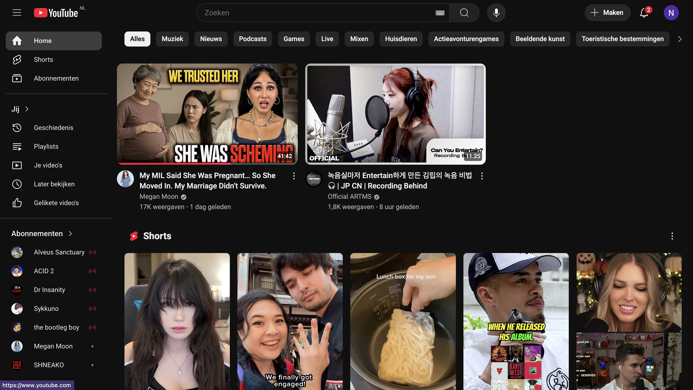
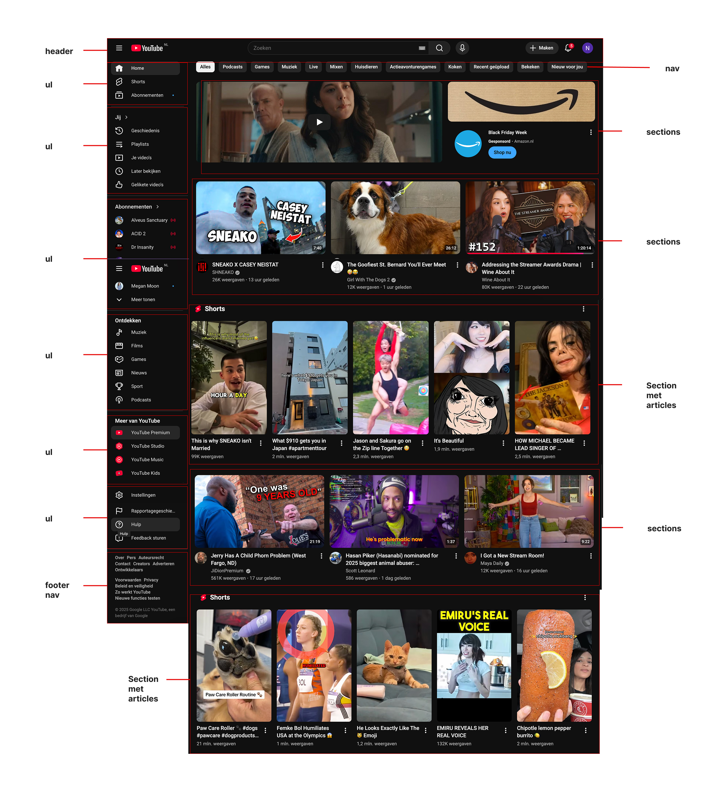

# Procesverslag
Markdown is een simpele manier om HTML te schrijven.  
Markdown cheat cheet: [Hulp bij het schrijven van Markdown](https://github.com/adam-p/markdown-here/wiki/Markdown-Cheatsheet).

Nb. De standaardstructuur en de spartaanse opmaak van de README.md zijn helemaal prima. Het gaat om de inhoud van je procesverslag. Besteedt de tijd voor pracht en praal aan je website.

Nb. Door *open* toe te voegen aan een *details* element kun je deze standaard open zetten. Fijn om dat steeds voor de relevante stuk(ken) te doen.

## Jij

  
uitwerken voor kick-off werkgroep

  ### Auteur:
  Nicky Kluivert

  #### Je startniveau:
  Blauw

  #### Je focus:
  Surface plane 
 

## Je website

  
uitwerken voor kick-off werkgroep

  ### Je opdracht:
  youtube, https://www.youtube.com/

  #### Screenshot(s) van de eerste pagina (small screen): 
  homepage van youtube  
  

  #### Screenshot(s) van de tweede pagina (small screen):
  video afspeelpagina 
  
  
 

## Toegankelijkheidstest 1/2 (week 1)

  
uitwerken na test in 2e werkgroep

  ### Bevindingen
  Lijst met je bevindingen die in de test naar voren kwamen:
  - Als je op de site komt krijg je als een van de eerste opties om de navigatie over te slaan bij Voice-over
  - Het is mogelijk om de hele site te navigeren met je toetsenbord
  - html code is niet valid
    

## Breakdownschets (week 1)

  
uitwerken na afloop 3e werkgroep

  ### de hele pagina: 
  

  ### dynamisch deel (bijv menu): 
  

  ### wellicht nog een dynamisch deel (bijv filter): 
  

## Voortgang 1 (week 2)

  
uitwerken voor 1e voortgang

  ### Stand van zaken
 Voor het voortgangsgesprek had ik alleen het breakdown schets uitgewerkt van de homepage van youtube.

  ### Verslag van meeting
  hier na afloop snel de uitkomsten van de meeting vastleggen

  - De articles moeten in sections (kans om de site toegankelijker te maken door de headings van de sections te gebruiken)
  - Het grote menu aan de linkerkant wordt een grote nav met allemaal ul's

## Voortgang 2 (week 3)

  
uitwerken voor 2e voortgang

  ### Stand van zaken
Voor het voortgangsgesprek had ik de tweede pagina breakdown schets afgemaakt en de eerste code uitgeschreven van de startpagina

  ### Verslag van meeting
  hier na afloop snel de uitkomsten van de meeting vastleggen

  - Mobiele scherm als prioriteit stellen (ik had mijn breakdown schetsen gebaseerd op de desktop versies)
  - De 
 in een span zetten zodat ik het makkelijker kan positioneren
  - 
- ...

## Toegankelijkheidstest 2/2 (week 4)

  
uitwerken na test in 9e werkgroep

  ### Bevindingen
  Lijst met je bevindingen die in de test naar voren kwamen (geef ook aan wat er verbeterd is):
  
  - De site is niet helemaal toegankelijk om met toetsenbord te navigeren(het selecteerd alleen de elementen die ik heb gelinkt)
    het leest de h2's niet op die ik in de articles heb staan
  - 
    

## Voortgang 3 (week 4)

  
uitwerken voor 3e voortgang

  ### Stand van zaken
Ik heb beide html codes al uitgeschreven, ik had alleen nog problemen met de flexboxes om de shorts deel de vormgeven op de start pagina

  ### Verslag van meeting
  hier na afloop snel de uitkomsten van de meeting vastleggen

  - voor de shortspagina ipv articles ul's gebruiken. omdat de grid pakte de h2 mee en daardoor klopte de indeling niet meer.
  - punt 2
  - nog een punt
  - ...

## Eindgesprek (week 5)

  
uitwerken voor eindgesprek

  ### Je uitkomst - karakteristiek screenshots:
  

  ### Dit ging goed/Heb ik geleerd: 
Tijdens dit project heb ik veel nieuwe dingen geleerd. Zo ontdekte ik hoe je met HTML, CSS en JavaScript een werkend hamburgermenu kunt maken. In het begin vond ik het best ingewikkeld, maar stap voor stap begon ik te begrijpen hoe de onderdelen samenwerken.

Ook leerde ik verschillende animaties toe te passen, zoals scale en rotate. Door daarmee te experimenteren, merkte ik hoe kleine bewegingen een website veel levendiger kunnen maken.

Daarnaast heb ik uitgezocht hoe je light en dark mode toevoegt aan een website. Het was interessant om te zien hoe je met een paar slimme aanpassingen de hele sfeer van een pagina kunt veranderen.

Tot slot heb ik geleerd hoe je CSS Grid gebruikt. Daarmee kun je op een overzichtelijke manier layouts maken die er zowel strak als flexibel uitzien.

Al met al heb ik veel nieuwe kennis opgedaan die ik straks in andere projecten kan gebruiken.

  

  ### Dit was lastig/Is niet gelukt:
  Korte omschrijving met plaatjes

  

## Bronnenlijst

  
continu bijhouden terwijl je werkt

  Nb. Wees specifiek ('css-tricks' als bron is bijv. niet specifiek genoeg). 
  Nb. ChatGpT en andere AI horen er ook bij.
  Nb. Vermeld de bronnen ook in je code.

  1. [bron 1](https://chatgpt.com/share/693b0adf-dd90-800f-927c-e68a47dfc47b)
  2. bron 2
  3. ...

